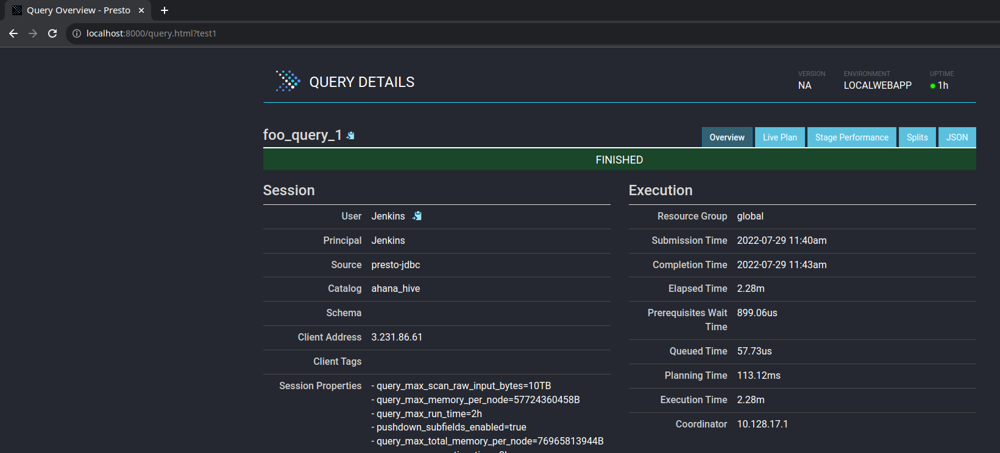

## Standalone Presto query viewer
This is a copy of the [existing Presto Web App](), tweaked to render locally stored 
query info JSON files

### Usage

1. Clone this repo
1. Store Query Info JSON files in the 'v1/query' folder. Say you save a file named `test1`
1. Start up the web app (at repo root) using :
```
python3 srv.py
```  

Now point your browser to `http://localhost:8000/query?<filename>` (e.g for above file use : `http://localhost:8000/query?test1` )

### Result
You should get the regular Presto UI view, rendering the familiar query details like so :  
  

Tab links in this page have been tweaked so that they point to the *correct* JSON file, even if it's name doesn't match the actual query ID stored in the JSON